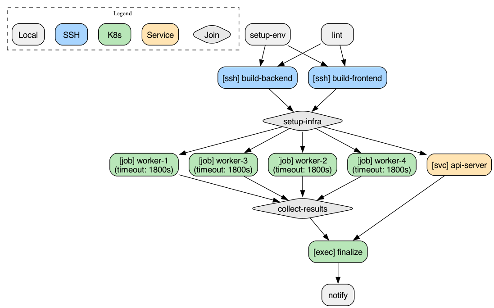
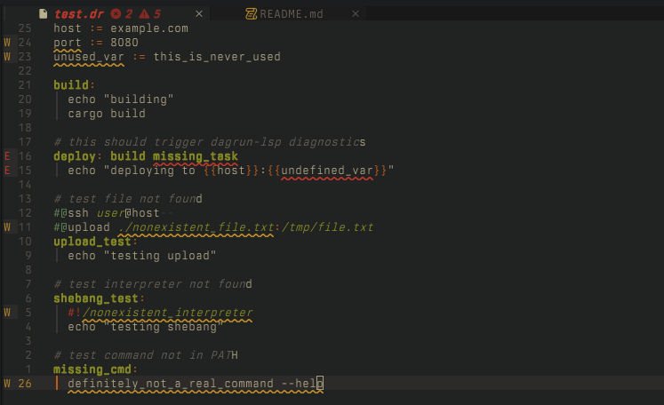

# dagrun

> What if you took make/just and airflow/dagster and combined them together?

A DAG-based task runner with SSH remote execution, Kubernetes integration, piped data flow, and Lua scripting.

## Status
> [!WARNING]
The API of `dagrun` is very much not stable, syntax might change in the near future!


## Why dagrun?

| Feature | make | just | ansible | dagrun |
|---------|------|------|---------|--------|
| DAG dependencies | partial | no | yes | yes |
| SSH remote execution | no | no | yes | yes |
| Kubernetes execution | no | no | no | yes |
| Piped data between tasks | no | no | no | yes |
| Managed services | no | no | no | yes |
| Lua scripting | no | no | no | yes |
| Graph visualization | no | no | no | yes |
| Shebang scripts | no | yes | no | yes |
| Simple syntax | no | yes | no | yes |

dagrun takes the simple, readable syntax of [just](https://github.com/casey/just) and adds DAG execution, SSH remote tasks, Kubernetes jobs, piped data flow, and embedded Lua for dynamic task generation.

## Install

```bash
cargo install --path .
```

## Quick Start

Create a `dagrun` file:

```bash
build:
    cargo build --release

# depends on build
test: build
    cargo test

@timeout 2m
@retry 1
deploy: test
    ./deploy.sh
```

Run it:

```bash
dagrun run deploy    # runs build -> test -> deploy
dagrun run test --only  # runs just test, skips deps
dagrun list          # list all tasks
```

## Shebang Scripts

Write tasks in any language by starting with a shebang. The script is written to a temp file and executed with the specified interpreter:

```bash
run-python:
    #!/usr/bin/env python3
    import json
    data = {"message": "hello from python"}
    print(json.dumps(data))

run-bash:
    #!/bin/bash
    set -euo pipefail
    echo "strict bash mode"

# uv inline script dependencies
run-uv:
    #!/usr/bin/env -S uv run --script
    # /// script
    # dependencies = ["requests"]
    # ///
    import requests
    print(requests.get("https://httpbin.org/ip").json())
```

Shebang scripts work with SSH and Kubernetes execution too - the script is transferred and executed on the remote.

## SSH Remote Execution

```bash
@ssh user@host workdir=/home/user/project
@upload ./local.sh:/tmp/remote.sh
remote-task:
    chmod +x /tmp/remote.sh && /tmp/remote.sh
```

## Kubernetes Execution

Run tasks as ephemeral K8s jobs, exec into existing pods, or apply manifests:

```bash
# ephemeral job
@k8s job image=python:3.11 namespace=ml-jobs
@k8s cpu=2 memory=4Gi
@k8s-configmap training-config:/etc/config
train-model:
    python train.py --config /etc/config/params.yaml

# exec into existing pod with file transfer
@k8s exec namespace=prod selector=app=api
@k8s-upload ./script.py:/tmp/script.py
@k8s-download /tmp/results.json:./results.json
run-script:
    python /tmp/script.py

# apply manifests with wait
@k8s apply path=./manifests/redis namespace=test
@k8s wait=deployment/redis timeout=5m
setup-redis:

# port forwarding during task
@k8s exec namespace=prod selector=app=api
@k8s-forward 5432:svc/postgres:5432
test-db:
    python test_connections.py
```

## Piped Data Flow

```bash
gen-data:
    echo "hello world"

@pipe_from gen-data
transform: gen-data
    tr 'a-z' 'A-Z'
```

## Managed Services

```bash
@service ready=http://localhost:8080/health startup_timeout=30s
api-server:
    ./start-server.sh

# waits for api-server to be healthy before running
integration-test: service:api-server
    pytest tests/
```

## Lua Scripting

```bash
@lua
for i = 1, 5 do
    task("worker-" .. i, {
        run = "echo 'processing chunk " .. i .. "'",
        depends_on = {"build"},
    })
end
@end

final: worker-1 worker-2 worker-3 worker-4 worker-5
    echo "done"
```

## Graph Visualization

Visualize your task graph with color-coded nodes showing task types:

```bash
dagrun graph              # ASCII art in terminal
dagrun graph -f dot       # Graphviz DOT format
dagrun graph -f png -o workflow.png  # PNG image (requires graphviz)
```



Lua-generated tasks are fully supported, including K8s config:

```lua
@lua
for i = 1, 4 do
    task("worker-" .. i, {
        run = "python process.py --shard " .. i,
        depends_on = {"setup-infra"},
        k8s = {
            mode = "job",
            image = "python:3.11",
            namespace = "staging",
            cpu = "1",
            memory = "2Gi"
        }
    })
end
@end
```

## Editor Integration

dagrun includes an LSP server for editor support:



**Features**: diagnostics, semantic highlighting, go-to-definition, find references, rename, hover docs, completions

**Install**:
```bash
cargo install --git https://github.com/wseaton/dagrun.git dagrun-lsp
```

See [crates/dagrun-lsp/README.md](crates/dagrun-lsp/README.md) for Neovim and Claude Code setup.

## Examples

See the `examples/` directory:

- `basic.dagrun` - variables, deps, timeouts, retries, Lua scripting
- `ssh.dagrun` - remote execution with uploads/downloads
- `ssh-service.dagrun` - managed services on remote hosts
- `ssh-service-remote.dagrun` - remote HTTP service example
- `k8s.dagrun` - Kubernetes jobs, exec, apply, file transfer, port forwarding
- `complex-hybrid.dagrun` - complex hybrid workflow with Lua-generated K8s workers
